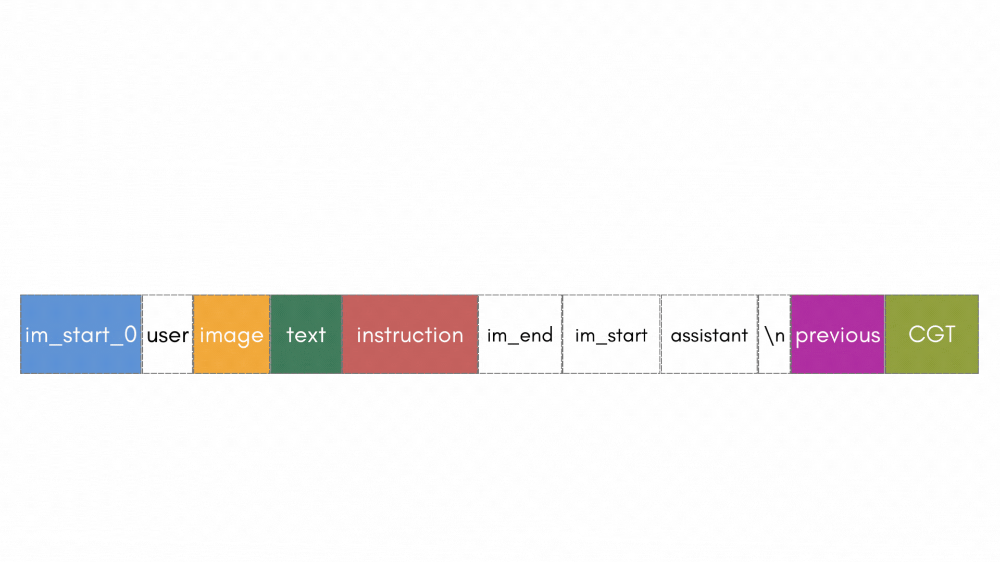

<h1 align="center"> Attending to Multimodal Generation One Token at a Time</h1>
<p align="center"><b>Tracking multimodal attention shifts during autoregressive generation</b></p>

<p align="center">
  <a href="https://arxiv.org/abs/2607.03738"></a>
  <a href="https://huggingface.co/datasets/katha-ai-iiith/one_token_at_a_time"></a>
  <a href="https://katha-ai.github.io/projects/otat/"></a>
  <a href="#citation"></a>
</p>

<p align="center">
  
  
</p>

---

Multimodal large language models (MLLMs) generate responses autoregressively, integrating visual
and linguistic information in an evolving context. Most interpretability work asks *where* in the
network this happens — which layers, which circuits. This repo is about *when*: how a model's
attention to the image, the text, the instruction, and its own previously generated tokens shifts
**one token at a time** as generation proceeds.

<p align="center">
  
</p>

Across two mainstream model families and four open-weight MLLMs, we find consistent patterns:
attention to the image peaks exactly at tokens that require image-derived information, instruction
tokens get revisited at task transitions, and attention to previously generated tokens grows as
generation progresses. We validate these patterns are *functional*, not just correlational, with
causal attention-blocking interventions, and use what we learn to build a simple test-time
intervention — boosting attention to the right modality at the right moment — that measurably
improves multimodal task performance.

This repository is the framework behind that analysis: attention extraction, blocking, and
boosting for autoregressive VLM/LLM generation, plus the task definitions, configs, and prompts
used to produce the paper's results.

## How it works

Each input is broken into **semantic chunks** — image, text, instruction, and (as generation
proceeds) previously-generated and currently-generating tokens. Generation runs **one token at a
time** (`max_new_tokens=1` per step, hooks re-registered every step) so that per-layer, per-head
attention *from* the currently-generating token *to* every other chunk can be captured, and
optionally blocked or boosted, at each individual decoding step.

<p align="center">
  
</p>

- **Extract** — record every layer's `{target chunk}__attends_to__{source chunk}` attention mass
  at each generation step.
- **Block** — zero out attention from a chunk via the attention mask, statically or dynamically
  (e.g. "until token X is generated", or "only the step right after token X").
- **Boost** — amplify attention to a chunk by scaling pre-softmax logits or post-softmax
  probabilities, the same way.

## Supported tasks

The paper's task suite requires models to explicitly switch between visual and textual context
within a single response:

| Task | Description |
|---|---|
| **Fruit-Math** | Identify a fruit in the image, then solve a math word problem embedded in the text prompt. |
| **Fruit-Sport** | Identify a fruit in the image, then answer a sport-related question from the text prompt. |
| **Math-Fruit** | Same underlying content as Fruit-Math, with the math and fruit sub-tasks reordered — isolates ordering effects on attention/task-switching. |
| **VSR** (Visual Spatial Reasoning) | Image and text each describe a spatial relation between two objects, deliberately mismatched — the model must attend to the correct modality per sub-question. |
| **ChartQA** | Two sequential questions about a chart image, requiring repeated image re-grounding. |

## Supported models

`models/` includes handlers for LLaVA-OneVision, Qwen2 (LLM-only), Qwen2.5-VL, Qwen3.5-VL,
Qwen2.5-Omni, Gemma 3, and Gemma 4 Omni. All are subclasses of `BaseModelHandler`
(`models/base_handler.py`) — adding a new model means implementing `load_model`, `build_inputs`,
and `get_attention_layers`.

## Installation

Requires **Python 3.10+**, PyTorch with CUDA, and a GPU with enough memory for whichever model
you're running.

```bash
conda create -n otat python=3.10 -y
conda activate otat
pip install -r requirements.txt
```

`requirements.txt` is intentionally minimal — it's the actual import surface of this repo, not a
full research-environment dump. If you're coming from a broader conda env (e.g. one also used for
training or other projects), most of its extra packages aren't needed here.

**Attention manipulation requires eager attention.** Every config in `configs/` sets
`model.attn_implementation: "eager"` — blocking and boosting work by hooking into
`self_attn.forward` and mutating the attention mask / softmax output directly, which isn't
possible with fused kernels (SDPA, FlashAttention). Don't switch this to speed things up; it will
silently disable the intervention.

## Data

Task CSVs, images, precomputed POS-tag outputs, and our derived evaluation results are hosted
separately on HuggingFace, not in this repo:
[katha-ai-iiith/one_token_at_a_time](https://huggingface.co/datasets/katha-ai-iiith/one_token_at_a_time).

```bash
pip install -U "huggingface_hub[cli]"
hf download katha-ai-iiith/one_token_at_a_time --repo-type dataset --local-dir data
```

This reconstructs a `data/` directory at the repo root matching exactly what `configs/**/*.yaml`
expect (`data.csv_path`, `data.image_base_dir`, `boosting.style.pos_dir` / `blocking.style.pos_dir`):

```
one_token_at_a_time/
├── data/          <- downloaded here
├── configs/
├── run_analysis.py
└── ...
```

See the dataset's own README for full provenance/licensing per image subdirectory (the Fruit-Math
and Fruit-Sport images are freely redistributable Open Images content and our own custom images;
the VSR and ChartQA images originate from COCO and various public chart sources respectively, and
are included only to ease reproducing this specific research — they belong to their original
creators, not to us).

## Usage

Every experiment is driven by a YAML config. `run_analysis.py` is the core entry point — it maps
`config['model']['type']` and `config['task']['name']` to the right handler/task classes and runs
the extraction (+ optional blocking/boosting) loop:

```bash
python run_analysis.py --config configs/vsr/vanilla.yaml
```

Output is one `.npz` per sample per layer under `{save_dir}/{layer_idx}/attention_progression/`,
containing the generated tokens plus one array per `{target}__attends_to__{source}` chunk pair.

Each task has a `vanilla.yaml` (no intervention), and, where applicable, `blocking.yaml` /
`boosting.yaml` variants demonstrating the intervention style described above — see `configs/`.
These are minimal, illustrative configs, not the exact sweep used for every paper number; adjust
`boost_factor`, `layers_to_boost`, `chunk_to_boost`, etc. for your own experiments.

For VSR and ChartQA, `vsr_pipeline.py` / `chartqa_pipeline.py` chain `run_analysis.py` with global
attention-mean computation:

```bash
python vsr_pipeline.py --config configs/vsr/vanilla.yaml
python chartqa_pipeline.py --config configs/chartqa/vanilla.yaml
```

For Fruit-Math / Fruit-Sport / Math-Fruit accuracy, `evaluate_fruit_math_accuracy.py` and
`useful_helpers/self_graded_accuracy_comparison.py` provide deterministic (non-LLM) scorers that
parse fruit/numeric answers directly out of generated text — no external API required.

### Reproducing the paper's Gemini-based evaluation

Semantic POS-tagging of generated tokens and LLM-graded accuracy in the paper were done via Gemini
on Vertex AI. The batch-job orchestration (GCS upload, job submission/polling) is GCP-account-
specific plumbing we don't ship, but the **exact prompts** we used are in `prompts/`:

- `gemini_pos_tagging_{vsr,chartqa,fruit_math}.txt` — semantic tagging of generated-token spans
- `gemini_evaluation_vsr_accuracy.txt`, `gemini_evaluation_fruit_math_error_profiling.txt` —
  accuracy / error-mode grading

Point these at whatever batch-inference setup you have (Vertex AI, the Gemini API directly, or
another judge model) to reproduce that half of the pipeline.

### Plotting

`data_plotting/` has the notebooks used to turn compiled per-tag attention CSVs into the paper's
figures (bar plots, line plots, layer-grouped views, confusion matrices). They expect a CSV/JSON
path at the top of each notebook — point it at your own run's output.

## Repository structure

```
run_analysis.py          Core entry point: config -> model handler -> task -> AttentionExtractor
vsr_pipeline.py           run_analysis.py + global attention-mean computation, for VSR
chartqa_pipeline.py       Same, for ChartQA
evaluate_fruit_math_accuracy.py   Deterministic accuracy scorer for Fruit-Math/Fruit-Sport/Math-Fruit

models/                   One handler per model family (BaseModelHandler subclasses)
tasks/                    One class per task (BaseTask subclasses)
analysis/                 Core mechanics: extraction, blocking, boosting
prompts/                  Task prompt templates + the Gemini tagging/grading prompts we used
configs/                  Minimal example YAML configs, one folder per task
useful_helpers/           Reusable accuracy/attention-analysis scripts for the 5 supported tasks
data_plotting/            Notebooks turning compiled CSVs into figures
utils/                    Logging, tokenization, chunk-index lookup, filename conventions
media/                    Images/animations used in this README
```

## Citation

```bibtex
@misc{gupta2026attending,
      title={Attending to Multimodal Generation One Token at a Time},
      author={Varun Gupta and Vineet Gandhi and Makarand Tapaswi},
      year={2026},
      eprint={2607.03738},
      archivePrefix={arXiv},
      primaryClass={cs.CV}
}
```

## License

This work is licensed under [CC BY-NC-SA 4.0](LICENSE) — Attribution-NonCommercial-ShareAlike.
You're free to use, adapt, and redistribute this code and any released data for non-commercial
purposes, with attribution, under the same license.

## Acknowledgments

Built at CVIT, IIIT Hyderabad.
